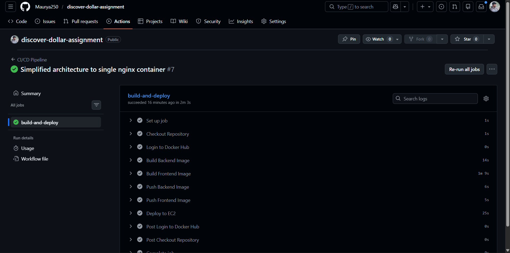
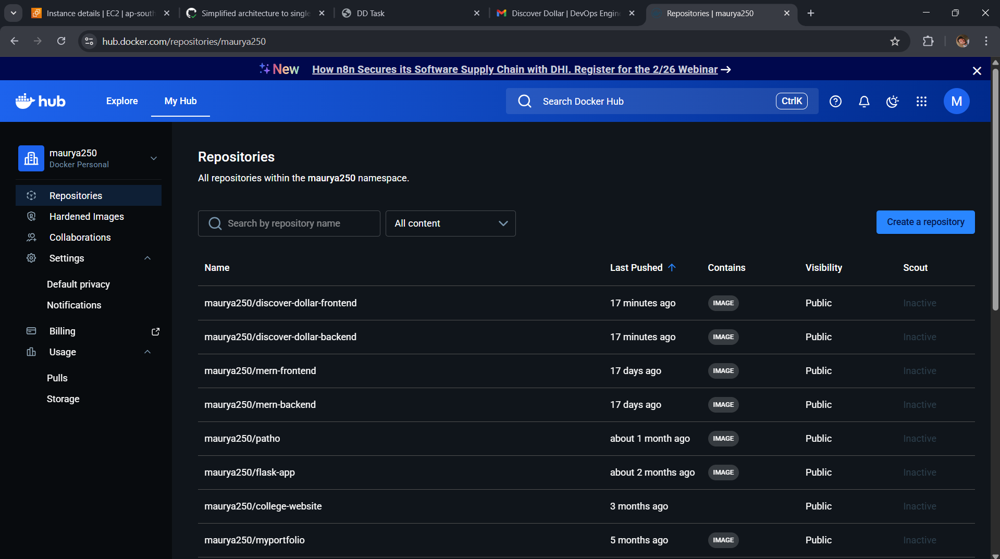
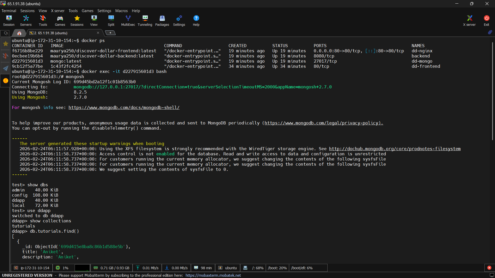
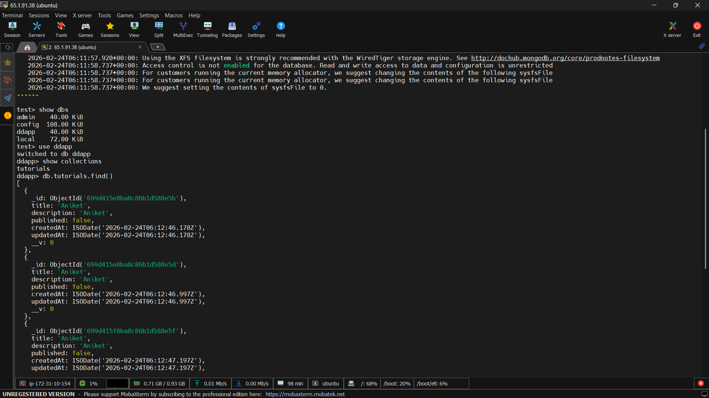
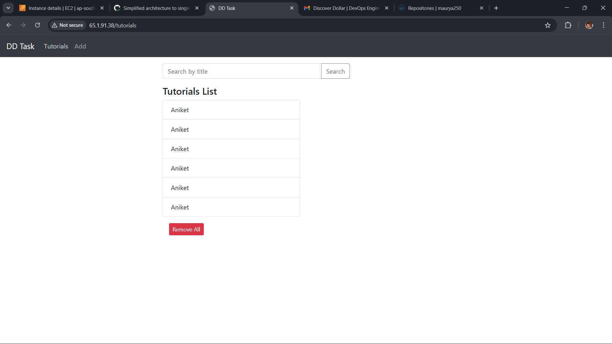
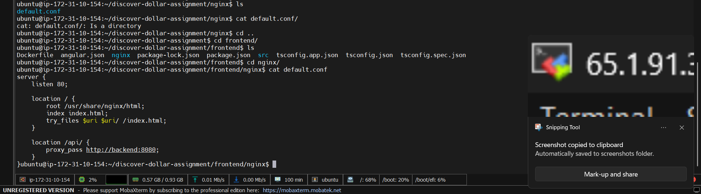

# DevOps Internship Assignment – MEAN Stack Application

## Overview

This project demonstrates containerization, CI/CD implementation, and cloud deployment of a MEAN (MongoDB, Express, Angular, Node.js) application.

The application is dockerized and deployed on an Ubuntu VM using Docker Compose. A CI/CD pipeline is configured to automatically build, push, and deploy updated Docker images. Nginx is used as a reverse proxy, and the complete application is accessible on port 80.

---

## Repository Structure

The repository contains:

- Frontend source code
- Backend source code
- Dockerfile for frontend
- Dockerfile for backend
- docker-compose.yml
- Nginx configuration
- GitHub Actions workflow file
- Screenshots folder

---

## Docker Setup

Both frontend and backend are containerized using Docker.

MongoDB is configured using the official MongoDB Docker image inside docker-compose.yml.

To build and start the application:

```bash
docker-compose up --build -d
```

To verify running containers:

```bash
docker ps
```

---

## Cloud Deployment

The application is deployed on an Ubuntu 22.04 virtual machine (AWS EC2).

Security group configuration:
- Port 22 (SSH)
- Port 80 (HTTP)

Docker and Docker Compose are installed on the VM.

The repository is cloned on the server and deployed using docker-compose.

Application access:

```
http://<VM-Public-IP>
```

---

## CI/CD Configuration

CI/CD is implemented using GitHub Actions.

Workflow file location:

```
.github/workflows/ci-cd.yml
```

Pipeline process:

1. Triggered on push to main branch
2. Builds frontend and backend Docker images
3. Pushes images to Docker Hub
4. Connects to VM via SSH
5. Pulls latest images
6. Restarts containers using docker-compose

The pipeline has been tested successfully with multiple commits.

---

## Nginx Reverse Proxy

Nginx is configured as a reverse proxy.

- Listens on port 80
- Routes frontend traffic to frontend container
- Routes `/api` requests to backend container

The entire application runs through port 80.

---

## Screenshots

The repository includes screenshots of:

- CI/CD workflow configuration
- Successful pipeline execution

- Docker image build and push logs

- Running containers on VM


- Working application UI

- Nginx configuration

- Cloud infrastructure details
- Cloud Provider: AWS EC2
- OS: Ubuntu 22.04 LTS
- Deployment: Dockerized Application
- Database: MongoDB (Port 27017)
- Reverse Proxy: Nginx
- Public Access: Enabled via Elastic IP
http://65.1.91.38/add


---

## Infrastructure Status

The cloud infrastructure is not deleted.

---

Aniket  
DevOps Internship Assignment  
Feb 2026